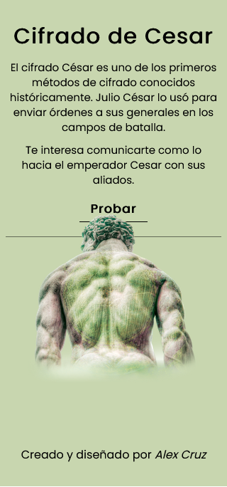
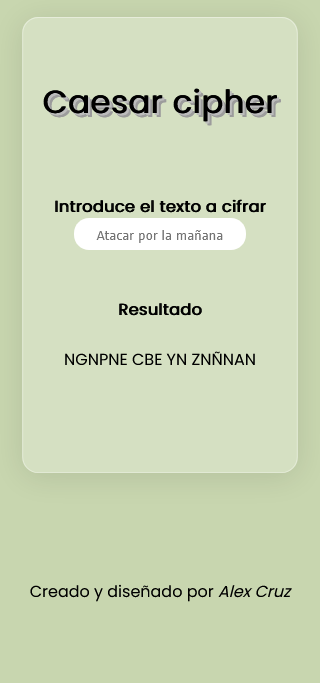
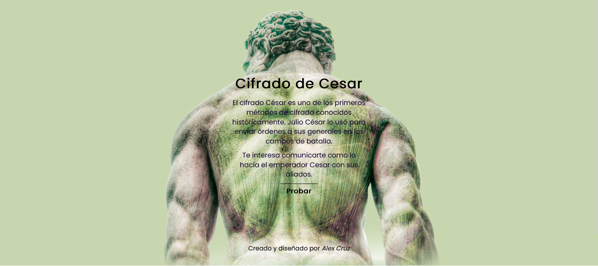
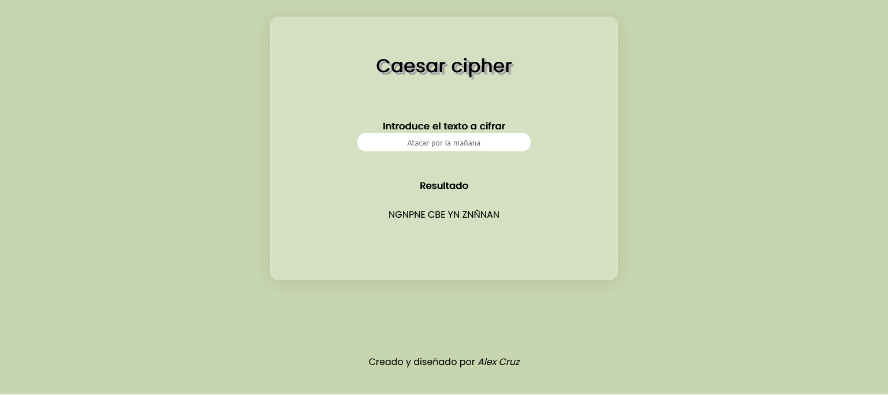

# Caesar-cipher
App that captures the value of the input and "encrypts" it and returns it encrypted

## Layouts






## Install
###### git clone o download the repo
```
** Open the proyect **
run: ** npm i **,
next: ** npm run dev ** and 
visit http://localhost:3000/  ```
